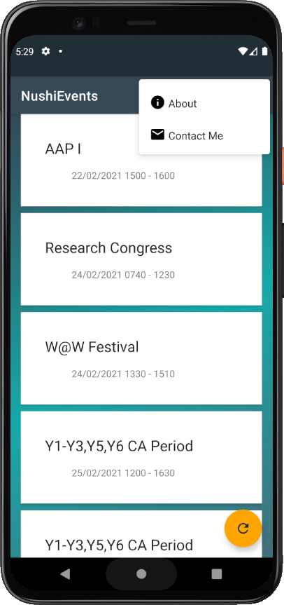
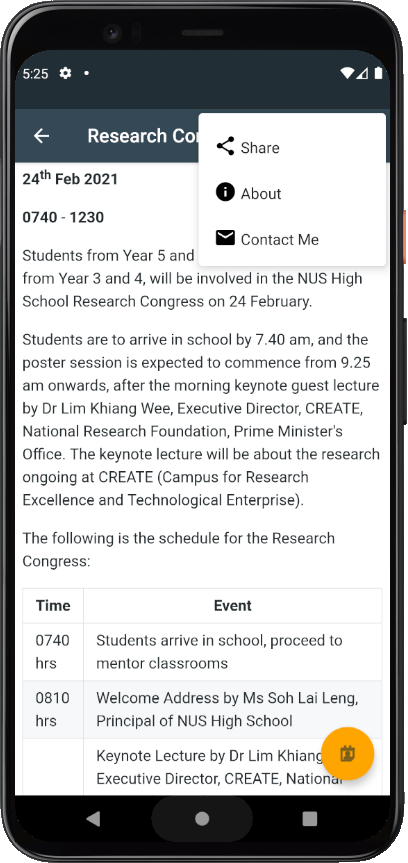
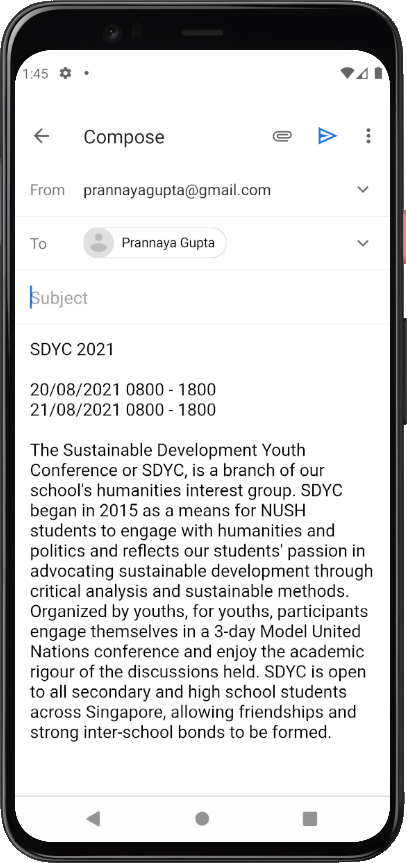
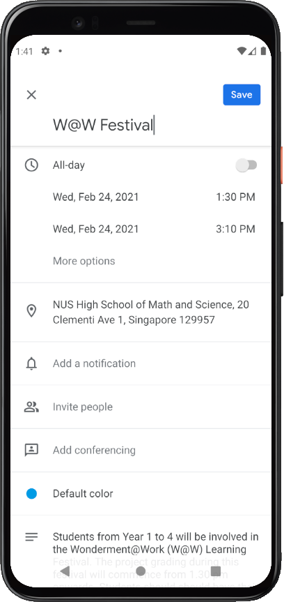
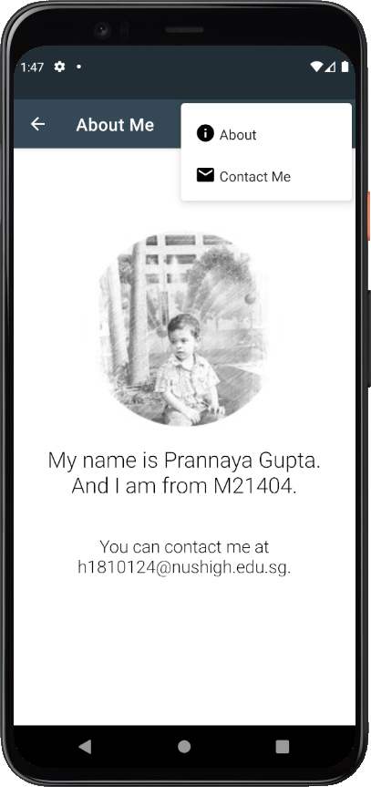

# NushiEvents
**Done by Prannaya Gupta**

Part of Assignment 1 in the CS4131 Module at NUS High School

An application to view upcoming or ongoing events in NUS High, based on finite list.

## Main List Page

This main page shows a list of events at NUS High School.

## Details Page

This page shows details about the Research Congress at NUS High. There is a CollapsingToolbar.

### Share Details

You can share the details on email/messenger apps/Drive by clicking on "Share".

### Save to Calendar

You can also save to calendar by clicking the FloatingActionButton.

## About Page

This about page shows my name, class and email.

All images are shown on a Google Pixel 4 Emulator running Android 9 (API 27).
